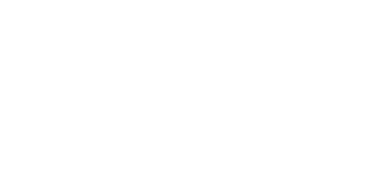
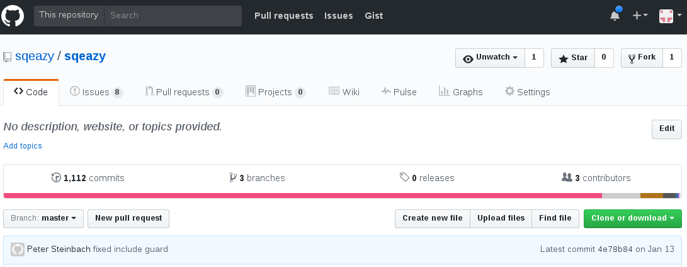
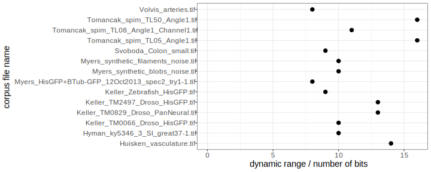

# Before I start

## Jeffrey != Peter 

[columns,class="row vertical-align"]

[column,class="col-xs-6"]

*presenter*

{ width=50% }  

[/column]

[column,class="col-xs-6"]

*author*

{ width=50% }  

[/column]

[/columns]

## Scionics Who?

[columns,class="row vertical-align"]

[column,class="col-xs-6"]

  
[Scionics Computer Innovation GmbH](https://www.scionics.com/)

[/column]

[column,class="col-xs-6"]

- founded in 2000, Dresden (Germany)
- service provider to the [Max Planck Institute of Molecular Cell Biology and Genetics](https://www.mpi-cbg.de/home/)  

    - scientific computing facility
    - IT infrastructure
    - public relations

[/column]

[/columns]

[notes]
- presentation of our institute
[/notes]

## This Talk is

[columns,class="row vertical-align"]

[column,class="col-xs-8"]

  

**[github.com/psteinb/gtc2017](https://github.com/psteinb/gtc2017)**

[/column]

. . . 

[column,class="col-xs-4"]

- code snippets

- presentation links

- [open an issue](https://github.com/psteinb/gtc2017/issues) for questions

[/column]

[/columns]

## Outline

1. Scientific Motivation

2. Sqeazy library

3. Results

# Big Data Deluge in Systems Biology

## [SPIM](https://en.wikipedia.org/wiki/Light_sheet_fluorescence_microscopy)

## Biologists love this!

<video width="1200" poster="movies/Drosophila_Embryogenesis_beads_removed.png" controls>
<source src="movies/Drosophila_Embryogenesis_beads_removed.webm" type='video/webm; codecs="vp8.0, vorbis"'>
<source src="movies/Drosophila_Embryogenesis_beads_removed.mp4" type='video/mp4'>

Movie does not work! Sorry!

</video>

[3d rendering of Drosophila embryogenesis time-lapse reconstructed from 5 angles SPIM recording, credits to Pavel Tomancak (MPI CBG)](https://extweb-srv5.mpi-cbg.de/de/research/research-groups/pavel-tomancak/movies.html)

## But ... 

[columns,class="row vertical-align"]

[column,class="col-xs-6"]

{width=100%}  

[/column]

[column,class="col-xs-6"]

- *today*:

	+ each CMOS camera can record 850 MB/s of 16bit grayscale 
	+ 2 cameras per scope, 1.7 GB/s

- scientists would like to capture long timelapses *1-2 days* (or more)

- total data volume per 1-2 day capture:  

*150-300 TiB* raw volume

= *57 - 114 kEUR* in SSDs

[/column]

[/columns]

## IT to the rescue

{ width=85% }  

## Does that scale? {data-background="img/ieee_data_deluge.jpg"}

# [Sqeazy](https://github.com/sqeazy/sqeazy)

## [Open-source Compression Library](https://github.com/sqeazy/sqeazy){ target="_blank" }

<a href="https://github.com/sqeazy/sqeazy" target="_blank">
{ width=90% }
</a>

## Yet another compression library?

[columns,class="row vertical-align"]

[column,class="col-xs-6"]

](img/800px-Paris_Tuileries_Garden_Facepalm_statue.jpg)

[/column]

[column,class="col-xs-6"]

- heart of sqeazy: pipeline mechanism
    - transform data so that it can be compressed best
    - use very good and fast encoders end the pipeline, e.g. [zstd](https://github.com/facebook/zstd), [lz4](https://github.com/lz4/lz4), [blosc](http://www.blosc.org/), ...  
    *use them, don't reinvent them!*

- do it fast! (multi-core, SIMD)

[/column]

[/columns]

## Can we do better?

3D in space = 2D in space + time!

. . .  

[columns,class="row vertical-align"]

[column,class="col-xs-8"]

](img/800px-Resolution_of_SD,_Full_HD,_4K_Ultra_HD_&_8K_Ultra_HD.svg.png){ width=80% }

[/column]

[column,class="col-xs-4"]

- multimedia industry and video codec research has worked in high-bandwidth/low-latency regime for years
- reuse their expertise through royalty free codecs
- currently looking into [h264/MPEG-4 AVC](https://en.wikipedia.org/wiki/H.264/MPEG-4_AVC) and [h265/hevc](https://en.wikipedia.org/wiki/High_Efficiency_Video_Coding), others are possible

[/column]

[/columns]

## Challenge: SPIM data

{width=90%}  

[columns,class="row"]

[column,class="col-xs-6"]

- raw data is encoded as _grey16_

[/column]

[column,class="col-xs-6"]

- pixel intensities occupy more than 8-bits  
mean +/- std = 11 +/- 3

[/column]

[/columns]

## Solution: Quantize data

- apply lossy bucket based transformation from 16 to 8 bits

WIP: illustrate lossyness by plot to have basis for comparison later

## ffmpeg

- using ffmpeg framework to interface sqeazy to

- support CPU and GPU based encoding/decoding

- enable future directions to non-x86 platforms 

- steep learning curve for using libavcodec API

- currently using ffmpeg 3.0.7

## hardware accelerated ffmpeg

show OS support table, and why nvenc is a valid choice

# Results

## benchmark platform

[columns,class="row"]

[column,class="col-xs-6"]

*hardware*

- dual socket Intel E5-2650v3
- 128GB DDR4 RAM
- 

[/column]

[column,class="col-xs-6"]

[/column]

[/columns]

## Ultrafast Baseline h264

## Ultrafast Baseline h265

## Ultrafast Baseline h264 on GPU

## Ultrafast Baseline h265 on GPU

# Summary
