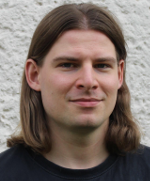
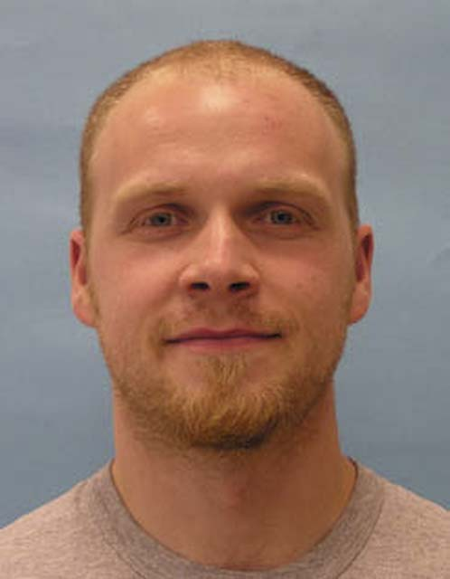
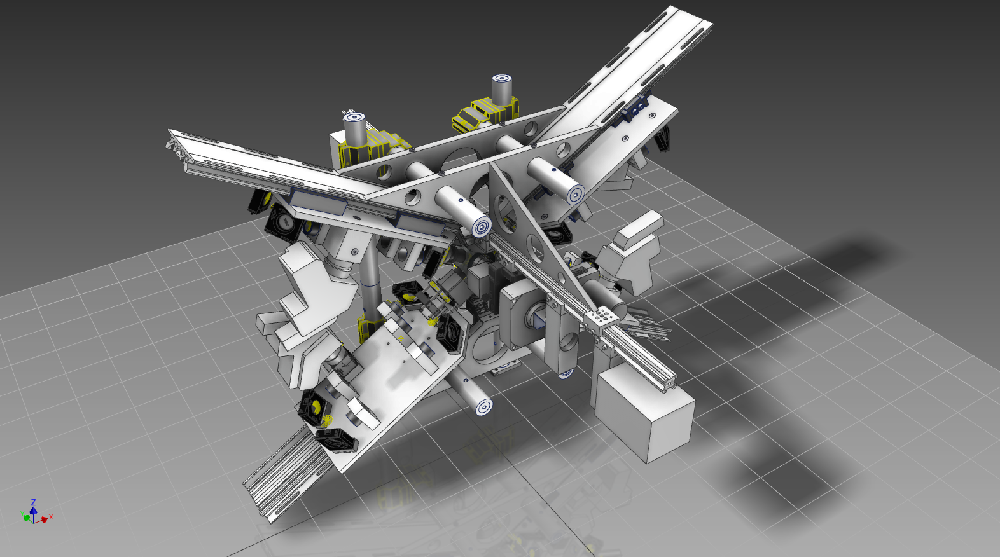

# Before I start

## Jeffrey != Peter 

[columns,class="row vertical-align"]

[column,class="col-xs-6"]

*presenter*

{ width=50% }  

[/column]

[column,class="col-xs-6"]

*author*

{ width=50% }  

[/column]

[/columns]

## Scionics Who?

[columns,class="row vertical-align"]

[column,class="col-xs-6"]

  
[Scionics Computer Innovation GmbH](https://www.scionics.com/)

[/column]

[column,class="col-xs-6"]

- founded in 2000, Dresden (Germany)
- service provider to the [Max Planck Institute of Molecular Cell Biology and Genetics](https://www.mpi-cbg.de/home/)  

    - scientific computing facility
    - IT infrastructure
    - public relations

[/column]

[/columns]

[notes]
- presentation of our institute
[/notes]

## This Talk is

[columns,class="row vertical-align"]

[column,class="col-xs-8"]

  

**[github.com/psteinb/gtc2017](https://github.com/psteinb/gtc2017)**

[/column]

. . . 

[column,class="col-xs-4"]

- code snippets

- presentation links

- [open an issue](https://github.com/psteinb/gtc2017/issues) for questions

[/column]

[/columns]

## Outline

1. Scientific Motivation

2. Sqeazy library

3. Results

# Big Data Deluge in Systems Biology

## [SPIM](https://en.wikipedia.org/wiki/Light_sheet_fluorescence_microscopy)

## Biologists love this!

<video width="1200" poster="movies/Drosophila_Embryogenesis_beads_removed.png" controls>
<source src="movies/Drosophila_Embryogenesis_beads_removed.webm" type='video/webm; codecs="vp8.0, vorbis"'>
<source src="movies/Drosophila_Embryogenesis_beads_removed.mp4" type='video/mp4'>

Movie does not work! Sorry!

</video>

[3d rendering of Drosophila embryogenesis time-lapse reconstructed from 5 angles SPIM recording, credits to Pavel Tomancak (MPI CBG)](https://extweb-srv5.mpi-cbg.de/de/research/research-groups/pavel-tomancak/movies.html)

## But ... 

[columns,class="row vertical-align"]

[column,class="col-xs-6"]

{width=100%}  

[/column]

[column,class="col-xs-6"]

- *today*:

	+ each CMOS camera can record 850 MB/s of 16bit grayscale 
	+ 2 cameras per scope, 1.7 GB/s

- scientists would like to capture long timelapses *1-2 days*

- total data volume: *150-300 TiB*

[/column]

[/columns]

## IT infrastructure to the rescue

